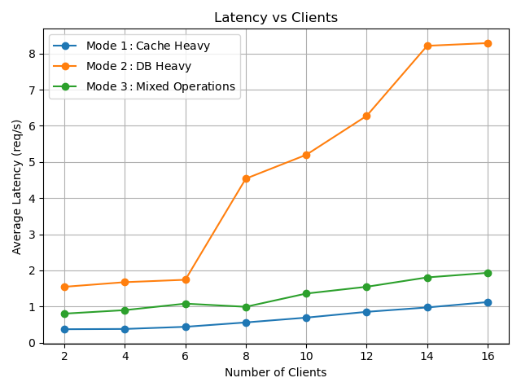
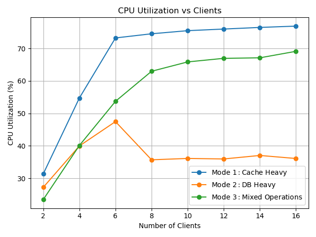

# KV Store Server & Load Generator

## Overview

### Server
It is lightweight key-value store server built with C++.
* Built with 3 layers
* HTTP interface built on cpp-httplib
* Integreted in memory LRU Cache for fast lookup
* Used PostgreSQL DB for persistant storage

### Load Generator
* Test mode:
  1. Mode 0: Cache Heavy
  2. Mode 1: DB Heavy
  3. Mode 2: Mixed Operation
* Key-Value pool generation at prior before testing
* Preloading server with key-value to showcase results in Mode 1 and 2
* Skewed data access pattern for achieving desirable results
* Provide performance metrics

#### Test modes
* **Mode 0 (Cache Heavy)** : 
  - Server preloaded with hotset (first 10% of actual pool set)
  - Over 90% operations is **GET**
  - 90% skewness for operation on hotset
* **Mode 1 (DB Heavy)** :
  - Server is not preloaded at beginning
  - Over 90% are **PUT** and **DELETE** requests
* **Mode 2 (Mixed Operation)** :
  - Server is preloaded with dataset 30% of pool
  - Reasonable distribution of requests (**GET:PUT:DELETE** :: 7:2:1)
  - Skewness for preloaded dataset is 50%

## Execution Instructions

1. Build the project.

```
make
```

2. Set database string in shell (terminal).

```
export DB_CONN="host=localhost port=5432 dbname=<dbname> user=<username> password=<password>"
```

3. Run the server.
```
./server.out <port> <threads> <cachesize>
```

4. Run the load generator.
```
./load_generator.out <host> <port> <clients> <test_duration> [think_time] [test_mode:0/1/2]
```


<!-- FLTO: 
g++ -std=c++17 -O3 -flto -pthread -Iinclude ./src/*.cpp -o server -I/usr/include/postgresql -lpq -->


## Testing Instruction 

### Individual testing

1. PUT request
```
curl -X PUT http://localhost:8000/api/<key> -d <value>
```

2. GET request
```
curl -X GET http://localhost:8000/api/<key>
```

3. DELETE request
```
curl -X DELETE http://localhost:8000/api/<key>
```

### Load Testing

#### Testing
1. Add all possible user input values (includeing credentials) in script file `load_test.sh`. 
2. Execute testing script as 
```
./load_test.sh
```

#### Plotting
1. Create virtual environment (venv) and install `pandas` and `matplotlib` library
2. Run `reports.py` file for available csv file named `results.csv`
```
python3 reports.py
```

## Result and Analysis

System configuration:
* Dedicated cores: 4
* Server threads: 8
* Database Connection Pool: 8
* Cache Size: 10000
* OS & Network Layer: WSL Linux Ubuntu

Testing configuration:
* Dedicated cores: 4
* Test time(each mode, each client): 30s
* Think Time: 0.1 ms

### Throughput


### Latency



### CPU Utilization

---